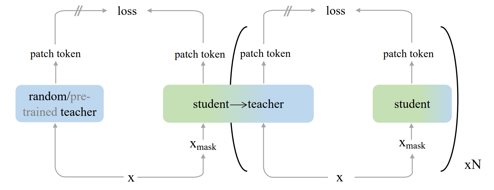
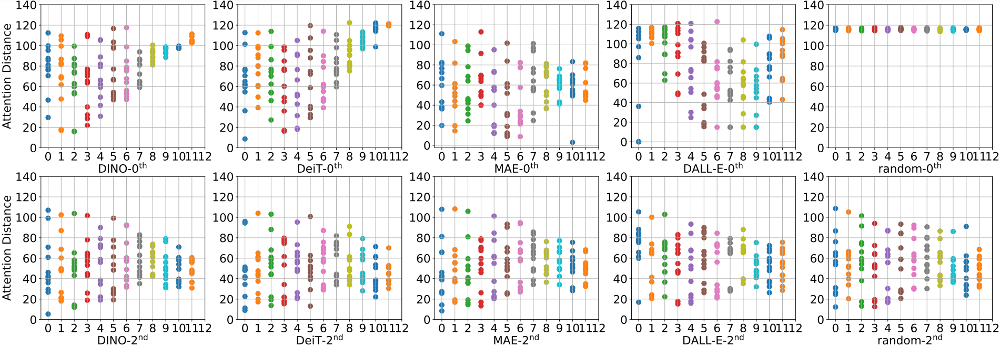
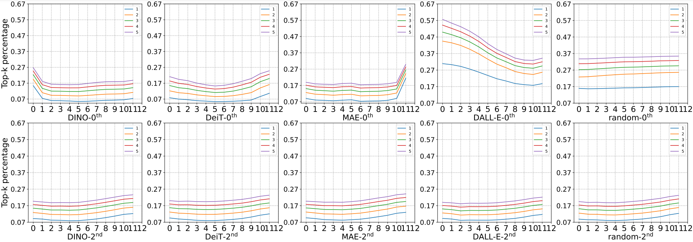

# Masked Autoencoding with dBOT 

[](https://paperswithcode.com/sota/self-supervised-image-classification-on-1?p=exploring-target-representations-for-masked)

[[`arXiv`](https://arxiv.org/abs/2209.03917)] [[`BibTex`](https://github.com/liuxingbin/dbot#citing-dbot)]

This is the official PyTorch implementation of [Exploring Target Representations for Masked Autoencoders](https://arxiv.org/abs/2209.03917).

<p align="center">
  
</p>


## News :tada:
- November 2022 - Release the code and pre-trained [models](https://github.com/liuxingbin/dbot#pre-trained-and-fine-tuned-models).
- September 2022 - Release the pre-print on [arXiv](https://arxiv.org/abs/2209.03917).


## Installation

Installation and preparation please follow [MAE](https://github.com/facebookresearch/mae) and [iBOT](https://github.com/bytedance/ibot). This repo is built upon `python==3.6`, `timm==0.4.12` and `pytorch==1.9.0`.

## Pre-Training
See [pre-training instruction](PRETRAIN.md) for details.

## Downstream Tasks
See [downstream instruction](DOWNSTREAM.md) for details.

## Pre-Trained and Fine-Tuned Models

We provide the pre-trained model (`pt. model`) and the finetuned model (`ft. model`) of dBOT in each experimental setup. You can download the pre-trained models for downstream tasks. `asym. enc-dec` being `√` denotes that the decoder is appended after encoder with fixed delayed mask and sin-cos position embedding. It being `×` denotes that the vanillia ViT is used with no delayed mask and relative position embedding.

<table>
  <tr>
    <th align="left">Arch.</th>
    <th align="center">Teacher</th>
    <th align="center">asym. enc-dec</th>
    <th align="center">cls.</th>
    <th align="center">det.</th>
    <th align="center">seg.</th>
    <th align="center" colspan="6">download</th>
  </tr>
  <tr>
    <td rowspan="4">ViT-B</td>
    <td align="center">ViT-B</td>
    <td align="center"><b>&#10003</b></td>
    <td align="center">84.5%</td>
    <td align="center">52.7</td>
    <td align="center">49.5</td>
    <td align="center" colspan="2"><a href="https://lf3-nlp-opensource.bytetos.com/obj/nlp-opensource/mmodal/dbot/84.5_dbot_base_pre.pth">pt. model</a></td>
    <td align="center" colspan="2"><a href="https://lf3-nlp-opensource.bytetos.com/obj/nlp-opensource/mmodal/dbot/84.5_dbot_base_finetune.pth">ft. model</a></d>
    <td align="center" colspan="2"><a href="https://drive.google.com/file/d/152UWszBdxn25bmwOzI0SaWVnrUg1t99a/view?usp=share_link">pt. log</a></td>
  </tr>
  <tr>
    <td align="center">ViT-L</td>
    <td align="center"><b>&#10003</b></td>
    <td align="center">84.6%</td>
    <td align="center">53.1</td>
    <td align="center">50.1</td>
    <td align="center" colspan="2"><a href="https://lf3-nlp-opensource.bytetos.com/obj/nlp-opensource/mmodal/dbot/84.6_dbot_large_base_pre.pth">pt. model</a></td>
    <td align="center" colspan="2"><a href="https://lf3-nlp-opensource.bytetos.com/obj/nlp-opensource/mmodal/dbot/84.6_dbot_large_base_finetune.pth">ft. model</a></d>
    <td align="center" colspan="2"><a href="https://drive.google.com/file/d/10NEWB5u-7tiwfcv3smi1E4Ov15qCWqKH/view?usp=share_link">pt. log</a></td>
  </tr>
  <tr>
    <td align="center">ViT-H</td>
    <td align="center"><b>&#10003</b></td>
    <td align="center">84.6%</td>
    <td align="center">53.5</td>
    <td align="center">50.8</td>
    <td align="center" colspan="2"><a href="https://lf3-nlp-opensource.bytetos.com/obj/nlp-opensource/mmodal/dbot/84.6_dbot_huge_base_pre.pth">pt. model</a></td>
    <td align="center" colspan="2"><a href="https://lf3-nlp-opensource.bytetos.com/obj/nlp-opensource/mmodal/dbot/84.6_dbot_huge_base_finetune.pth">ft. model</a></d>
    <td align="center" colspan="2"><a href="https://drive.google.com/file/d/113S5kcIf9gd1ZbIGIuhdu0f9Hk_qmRIT/view?usp=share_link">pt. log</a></td>
  </tr>
  <tr>
    <td align="center"><a href="https://github.com/openai/CLIP">CLIP-B/16</a></td>
    <td align="center">&#10008</td>
    <td align="center">85.7%</td>
    <td align="center">53.6</td>
    <td align="center">52.9</td>
    <td align="center" colspan="2"><a href="https://lf3-nlp-opensource.bytetos.com/obj/nlp-opensource/mmodal/dbot/85.7_clip_base_pre.pth">pt. model</a></td>
    <td align="center" colspan="2"><a href="https://lf3-nlp-opensource.bytetos.com/obj/nlp-opensource/mmodal/dbot/85.7_clip_base_finetune.pth">ft. model</a></d>
    <td align="center" colspan="2"><a href="https://lf3-nlp-opensource.bytetos.com/obj/nlp-opensource/mmodal/dbot/85.7_clip_base_pre.txt">pt. log</a></td>
  </tr>
  <tr>
    <td rowspan="3">ViT-L</td>
    <td align="center">ViT-L</td>
    <td align="center"><b>&#10003</b></td>
    <td align="center">86.6%</td>
    <td align="center">56.0</td>
    <td align="center">54.5</td>
    <td align="center" colspan="2"><a href="https://lf3-nlp-opensource.bytetos.com/obj/nlp-opensource/mmodal/dbot/86.6_dbot_large_pre.pth">pt. model</a></td>
    <td align="center" colspan="2"><a href="https://lf3-nlp-opensource.bytetos.com/obj/nlp-opensource/mmodal/dbot/86.6_dbot_large_finetune.pth">ft. model</a></d>
    <td align="center" colspan="2"><a href="https://drive.google.com/file/d/1h7QIRbyxmku9Vd_bWjqLkUBp0JxyZSak/view?usp=share_link">pt. log</a></td>
  </tr>
  <tr>
    <td align="center">ViT-H</td>
    <td align="center"><b>&#10003</b></td>
    <td align="center">86.8%</td>
    <td align="center">56.1</td>
    <td align="center">55.2</td>
    <td align="center" colspan="2"><a href="https://lf3-nlp-opensource.bytetos.com/obj/nlp-opensource/mmodal/dbot/86.8_dbot_huge_large_pre.pth">pt. model</a></td>
    <td align="center" colspan="2"><a href="https://lf3-nlp-opensource.bytetos.com/obj/nlp-opensource/mmodal/dbot/86.8_dbot_huge_large_finetune.pth">ft. model</a></d>
    <td align="center" colspan="2"><a href="https://drive.google.com/file/d/1cFAVnAnYLVmnlzXxmlSY_rUxSF50-sZQ/view?usp=share_link">pt. log</a></td>
  </tr>
  <tr>
    <td align="center"><a href="https://github.com/openai/CLIP">CLIP-L/14</a></td>
    <td align="center">&#10008</td>
    <td align="center">87.8%</td>
    <td align="center">56.8</td>
    <td align="center">56.2</td>
    <td align="center" colspan="2"><a href="https://lf3-nlp-opensource.bytetos.com/obj/nlp-opensource/mmodal/dbot/87.8_clip_large_pre.pth">pt. model</a></td>
    <td align="center" colspan="2"><a href="https://lf3-nlp-opensource.bytetos.com/obj/nlp-opensource/mmodal/dbot/87.8_clip_large_finetune.pth">ft. model</a></d>
    <td align="center" colspan="2"><a href="https://lf3-nlp-opensource.bytetos.com/obj/nlp-opensource/mmodal/dbot/87.8_clip_large_pre.txt ">pt. log</a></td>
  </tr>
  <tr>
    <td rowspan="2">ViT-H</td>
    <td align="center">ViT-H</td>
    <td align="center"><b>&#10003</b></td>
    <td align="center">87.4%</td>
    <td align="center">-</td>
    <td align="center">-</td>
    <td align="center" colspan="2"><a href="https://lf3-nlp-opensource.bytetos.com/obj/nlp-opensource/mmodal/dbot/87.4_dbot_huge_pre.pth">pt. model</a></td>
    <td align="center" colspan="2"><a href="https://lf3-nlp-opensource.bytetos.com/obj/nlp-opensource/mmodal/dbot/87.4_dbot_huge_finetune.pth">ft. model</a></d>
    <td align="center" colspan="2"><a href="https://drive.google.com/file/d/1h7QIRbyxmku9Vd_bWjqLkUBp0JxyZSak/view?usp=share_link">pt. log</a></td>
  </tr>
  <tr>
    <td align="center"><a href="https://github.com/openai/CLIP">CLIP-L/14</a></td>
    <td align="center">&#10008</td>
    <td align="center">88.5%</td>
    <td align="center">-</td>
    <td align="center">-</td>
    <td align="center" colspan="2"><a href="https://lf3-nlp-opensource.bytetos.com/obj/nlp-opensource/mmodal/dbot/88.5_clip_huge_pre.pth">pt. model</a></td>
    <td align="center" colspan="2"><a href="https://lf3-nlp-opensource.bytetos.com/obj/nlp-opensource/mmodal/dbot/88.5_clip_huge_finetune.pth">ft. model</a></d>
    <td align="center" colspan="2"><a href="https://lf3-nlp-opensource.bytetos.com/obj/nlp-opensource/mmodal/dbot/88.5_clip_huge_pre.txt">pt. log</a></td>
  </tr>
  <tr>
    <td rowspan="2">ViT-H<sub>448</sub></td>
    <td align="center">ViT-H</td>
    <td align="center"><b>&#10003</b></td>
    <td align="center">88.0%</td>
    <td align="center">-</td>
    <td align="center">-</td>
    <td align="center" colspan="2"><a href="https://lf3-nlp-opensource.bytetos.com/obj/nlp-opensource/mmodal/dbot/87.4_dbot_huge_pre.pth">pt. model</a></td>
    <td align="center" colspan="2"><a href="https://lf3-nlp-opensource.bytetos.com/obj/nlp-opensource/mmodal/dbot/88.0_dbot_huge_448_finetune.pth">ft. model</a></d>
    <td align="center" colspan="2"><a href="https://drive.google.com/file/d/1h7QIRbyxmku9Vd_bWjqLkUBp0JxyZSak/view?usp=share_link">pt. log</a></td>
  </tr>
  <tr>
    <td align="center"><a href="https://github.com/openai/CLIP">CLIP-L/14</a></td>
    <td align="center">&#10008</td>
    <td align="center">89.1%</td>
    <td align="center">-</td>
    <td align="center">-</td>
    <td align="center" colspan="2"><a href="https://lf3-nlp-opensource.bytetos.com/obj/nlp-opensource/mmodal/dbot/88.5_clip_huge_finetune.pth">pt. model</a></td>
    <td align="center" colspan="2"><a href="https://lf3-nlp-opensource.bytetos.com/obj/nlp-opensource/mmodal/dbot/89.1_clip_huge_448_finetune.pth">ft. model</a></d>
    <td align="center" colspan="2"><a href="https://lf3-nlp-opensource.bytetos.com/obj/nlp-opensource/mmodal/dbot/88.5_clip_huge_pre.txt">pt. log</a></td>
  </tr>
</table>

:dart: This branch is the implementation of dBOT with default asymmetric encoder-decoder architecture. For symmetric architecture with which we use CLIP as the pre-trained teacher, please see [beit branch](https://github.com/liuxingbin/dbot/tree/beit) for details.

## Property Analysis

To demonstrate models' differences in terms of weigths and outputs, we conduct property analysis using averaged attention distance and singular value decomposition. We compute the averaged attention distance for each attention head of different Transformer blocks. The results are averaged over IN1K validation set:

<p align="center">
  
</p>
 
We also compute the percentage of tok-k (varing from 1 to 5) singular values of the embedding w.r.t each layer:

<p align="center">
  
</p>

The student networks distilled from different initialized teachers exhibit similar behaviors, which clearly indicate that the teacher network does not matter with bootstrapped teachers.

## Acknowledgement

This reposity is modified upon the [MAE](https://github.com/facebookresearch/mae) repository and [iBOT](https://github.com/bytedance/ibot) repository.

## License

This project is under the Apache 2.0 license as found in [LICENSE](LICENSE) file.

## Citing dBOT

Please consider citing dBOT and giving a star if dBOT helps your research:
```
@article{liu2022exploring,
  title={Exploring target representations for masked autoencoders},
  author={Liu, Xingbin and Zhou, Jinghao and Kong, Tao and Lin, Xianming and Ji, Rongrong},
  journal={arXiv preprint arXiv:2209.03917},
  year={2022}
}
``` 
